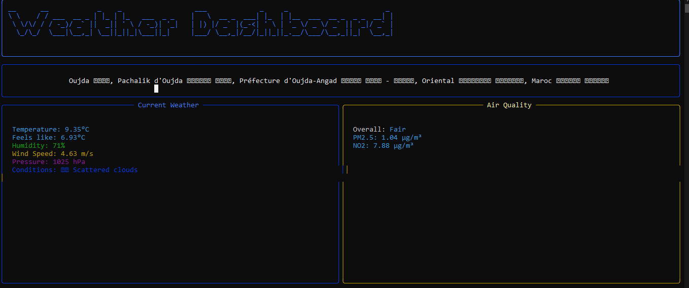
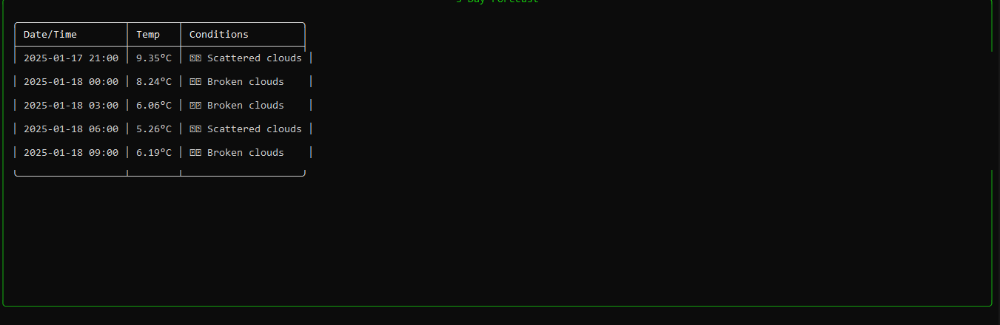

<div align="center">

# 🌦️ Modern Weather Dashboard

[](https://www.python.org)
[](https://openweathermap.org)
[](LICENSE)
[](https://github.com/ahmedtouzani/weather-dashboard/graphs/commit-activity)
[](https://github.com/ahmedtouzani)

<p align="center">
  
</p>

---

### 🌈 A stunning terminal-based weather dashboard with real-time data and beautiful animations

<div align="center">
  <table>
    <tr>
      <td></td>
    </tr>
    <tr>
      <td align="center"><strong>Modern Terminal UI with Real-time Weather Data</strong></td>
    </tr>
  </table>
</div>

## ✨ Key Features

<table>
  <tr>
    <td>
      <h3>🎨 Beautiful Interface</h3>
      <ul>
        <li>ASCII art title animations</li>
        <li>Rich color schemes</li>
        <li>Modern panel layout</li>
        <li>Progress animations</li>
      </ul>
    </td>
    <td>
      <h3>🌍 Weather Data</h3>
      <ul>
        <li>Real-time conditions</li>
        <li>5-day forecast</li>
        <li>Air quality monitoring</li>
        <li>Detailed metrics</li>
      </ul>
    </td>
    <td>
      <h3>⚡ Performance</h3>
      <ul>
        <li>Async data fetching</li>
        <li>Efficient caching</li>
        <li>Smart error handling</li>
        <li>Responsive UI</li>
      </ul>
    </td>
  </tr>
</table>

## 🎥 Features Showcase

<div align="center">
  <table>
    <tr>
      <td></td>
    </tr>
    <tr>
      <td align="center"><strong>Detailed 5-Day Weather Forecast</strong></td>
    </tr>
  </table>
</div>

## 🚀 Installation

### Prerequisites

- Python 3.11 or higher
- pip package manager
- OpenWeatherMap API key

### One-Line Installation

```bash
git clone https://github.com/ahmedtouzani/weather-dashboard.git && cd weather-dashboard && pip install -r requirements.txt
```

### Manual Installation

1. Clone the repository:
   ```bash
   git clone https://github.com/ahmedtouzani/weather-dashboard.git
   cd weather-dashboard
   ```

2. Install dependencies:
   ```bash
   pip install -r requirements.txt
   ```

3. Set up environment:
   ```bash
   cp .env.example .env
   # Edit .env and add your OpenWeatherMap API key
   ```

## 🎮 Usage

### Quick Start

```bash
python weather_dashboard.py
```

### Command Line Arguments

```bash
python weather_dashboard.py --city "Paris" --units metric --refresh 30
```

| Argument | Description | Default |
|----------|-------------|---------|
| --city   | Default city to show | None |
| --units  | Temperature units (metric/imperial) | metric |
| --refresh| Auto-refresh interval (seconds) | 0 |

## 🛠️ Technical Features

### Weather Data
- Real-time temperature and conditions
- Humidity and atmospheric pressure
- Wind speed and direction
- Visibility and cloud cover
- Sunrise and sunset times
- UV index

### Air Quality
- AQI (Air Quality Index)
- Pollutant measurements
- Health recommendations
- Historical data

### Forecast
- 5-day weather prediction
- Hourly temperature changes
- Precipitation probability
- Weather alerts and warnings

## 🎨 Customization

### Color Themes
```python
# In your .env file
THEME=dark  # Options: dark, light, custom
CUSTOM_COLORS={"background": "#1a1b26", "text": "#a9b1d6"}
```

### Display Options
```python
# In your .env file
SHOW_ICONS=true
TEMPERATURE_UNITS=celsius  # celsius, fahrenheit
WIND_UNITS=ms  # ms (m/s), mph, kmh
```

## 🔧 Advanced Configuration

### API Configuration
```env
OPENWEATHER_API_KEY=your_key_here
API_TIMEOUT=10
CACHE_DURATION=300
MAX_RETRIES=3
```

### Proxy Settings
```env
HTTP_PROXY=http://proxy.example.com:8080
HTTPS_PROXY=https://proxy.example.com:8080
```

## 🌟 Contributing

We welcome contributions! Here's how you can help:

1. 🍴 Fork the repository
2. 🌿 Create a feature branch (`git checkout -b feature/AmazingFeature`)
3. 💾 Commit changes (`git commit -m 'Add AmazingFeature'`)
4. 🚀 Push to branch (`git push origin feature/AmazingFeature`)
5. 🔍 Open a Pull Request

## 👨‍💻 Author


### Ahmed Touzani

Full-stack developer passionate about creating beautiful and functional applications.

[](mailto:touzaniahmed39@gmail.com)
[](https://github.com/ahmedtouzani)
[](https://ahmedtouzani.github.io)

<br clear="left"/>

## 📄 License

This project is licensed under the MIT License - see the [LICENSE](LICENSE) file for details.

## 🙏 Acknowledgments

- OpenWeatherMap for their comprehensive weather API
- Rich library for beautiful terminal formatting
- The Python community for amazing tools and support

---

<div align="center">

Made with ❤️ by [Ahmed Touzani](https://github.com/ahmedtouzani)

⭐ Star this repository if you find it helpful!

</div>
